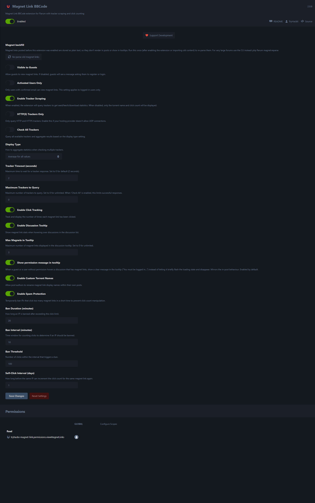
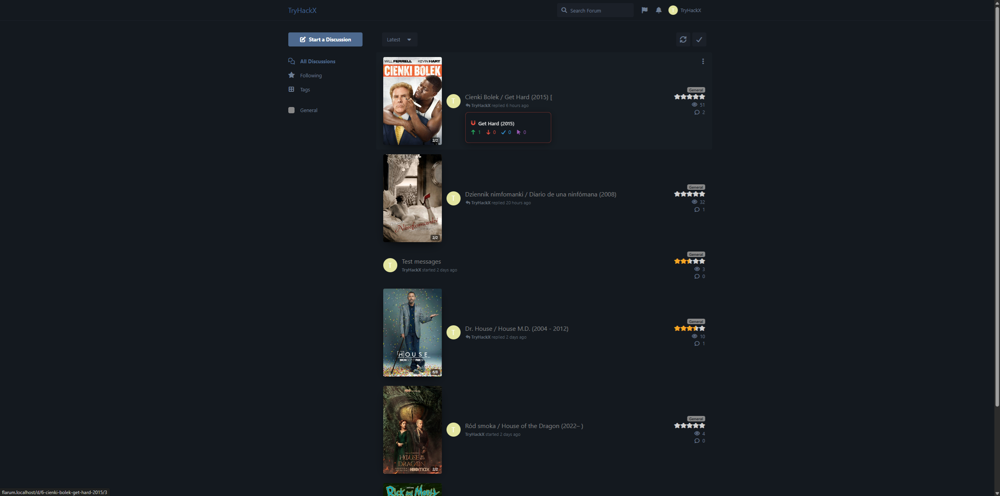
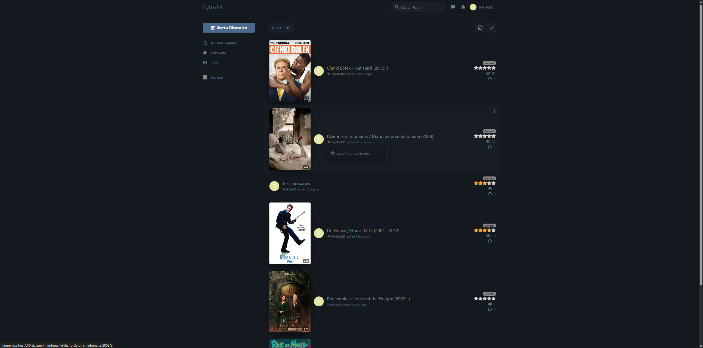

# TryHackX Magnet Link

A powerful, secure, and highly customisable Flarum extension for embedding
and managing **magnet links**. Token-protected magnet URIs, live tracker
scraping (Seeders / Leechers / Completed), per-link click counters with
anti-spam protection, custom display names, a discussion-list hover
tooltip, and a CLI / one-click admin backfill for posts that were written
before the extension was enabled.

## 🚀 Versions & Compatibility

This extension is developed in parallel to support both legacy and modern
Flarum installations:

- **Version 2.x** — Fully compatible with the latest Flarum 2.x routing and
  frontend architecture. **Actively developed.**
- **Version 1.x** — Supports legacy Flarum 1.8.0 and above. **No longer
  actively developed** — stays available for legacy installs but won't
  receive new features.

> **Latest highlights (2.2.0):**
> - **SSRF-hardened scraping** — tracker hosts come from post content, so the
>   scraper now refuses trackers that resolve to private / loopback / reserved
>   addresses (internal services, cloud metadata), with an admin opt-in for
>   intentional private trackers. Tracker contacts are capped and bounded by a
>   wall-clock budget so a malicious magnet can't tie up a worker.
> - **Configurable result cache** — seed/leech/download stats are cached
>   (server + browser) with admin controls to set the lifetime or turn it off;
>   the refresh button forces a genuine re-scrape.
> - **Rate-limited manual refresh** — the refresh button is bounded by a global
>   per-magnet cooldown (one refresh updates the shared result everyone sees)
>   and a per-IP sliding-window quota (guests included), all admin-configurable.
> - **Responsive card + display styles** — reworked mobile layout (full wrapping
>   name, single-line stats with a fluid font), plus an admin option to use that
>   mobile layout on desktop too, with line-clamp and stats-alignment controls.
> - **"Check All" / "Display Type" now actually work** — they aggregate
>   seeders/leechers/completed across trackers (average / average-max-downloads
>   / max-all); previously they were inert settings.
> - **Click IP from Flarum core** — click de-dup / ban tracking now uses the
>   framework's resolved IP instead of spoofable proxy headers.
> - **Magnet backfill** — re-parse posts whose `[magnet]` BBCode was saved
>   before the extension was active (via `php flarum magnet:reparse` or
>   the admin button).

## ✨ Features

### Core functionality

- **Secure embedding** — raw magnet URIs are never exposed in the HTML
  source. They're protected by SHA-256 tokens and retrieved via API.
  Guests can be locked out entirely.
- **Text editor integration** — adds a magnet icon to the Flarum editor;
  wraps the current selection or inserts `[magnet][/magnet]` at the
  cursor.
- **Multilingual** — English and Polish bundled.

### Real-time statistics (scraper)

- **Tracker scraping** for HTTP / HTTPS / UDP trackers, with live
  **Seeders / Leechers / Completed** counts (powered by the
  [Scrapeer](https://github.com/medariox/scrapeer) library).
- **SSRF protection** — tracker hosts are resolved and validated before any
  request; private / loopback / reserved targets are blocked by default
  (admin opt-in for intentional private trackers). Contacts are capped and
  time-budgeted so a single magnet can't exhaust a worker.
- **Aggregation modes** — with *Check All Trackers* on, results are combined
  across trackers as average, average-max-downloads, or max-all.
- **Result caching** — stats are cached server-side and in the browser; the
  lifetime is configurable and caching can be turned off entirely.
- **Performance knobs** — configurable per-tracker timeout and max
  tracker count.
- **Manual refresh (rate-limited)** — per-link refresh button to re-pull fresh
  stats (bypasses the cache for a genuine re-scrape). Bounded by a global
  per-magnet cooldown — one refresh updates the shared result everyone sees —
  and a per-IP sliding-window quota that covers guests too; both configurable.

### Discussion-list tooltip

- **Hover tooltip** on the discussion list that previews the topic's
  magnets and their current stats — without opening the topic.
- **Smart gating** — the tooltip only fires for discussions that
  actually have a magnet in the opening post (`hasMagnetLinks`
  attribute), so non-magnet discussions never trigger an API call.
- **Tracker error rendering** — when no tracker responds (or the
  magnet has no trackers, no HTTP trackers, etc.) the tooltip shows the
  localised error message instead of nothing, mirroring the in-post
  widget.
- **Permission message rendering** — for guests / unverified /
  no-permission users you can choose to show
  "You must be logged in to view magnet links. Login or Register"
  (toggle in admin, on by default) instead of letting "Loading…" flash
  and disappear.
- **Configurable client cache** — the same magnet hovered repeatedly only
  hits the API once within the cache lifetime (default 5 minutes; adjustable
  or disable-able from admin, in sync with the server-side cache).

### Backfill for old posts

For discussions whose `[magnet]…[/magnet]` BBCode was written **before**
this extension was enabled, the parsed XML stored in `posts.content`
doesn't contain `<MAGNET>` tags — so neither the in-post button nor the
tooltip works.

This release ships two ways to fix it:

- **CLI:** `php flarum magnet:reparse` — batched, idempotent, no HTTP
  timeout (preferred for large forums).
- **Admin button:** *Re-parse old magnet links* in the extension
  settings — calls a small admin-gated endpoint that runs the same
  re-parser synchronously (handy after a fresh install / content import).

Both use the same `MagnetReparser` service, which:

- Targets only posts whose XML contains the literal `[magnet]` BBCode but
  not yet a `<MAGNET>` tag.
- Goes through them in chunks of 50 (`chunkById`).
- Re-parses each post via the content accessor / mutator — which unparses
  the stored XML back to its source and re-parses it with the now-active
  formatter, producing `<MAGNET>` tags.
- Is safe to run repeatedly: posts that already have `<MAGNET>` are
  excluded by the query; re-parsing one that's already correct produces
  identical XML.

### Custom torrent names

- Post authors can rename their magnet links from the post UI.
- The custom name is stored per magnet × post pair, so the same magnet
  can appear under different names in different topics.

### Analytics & protection

- **Click counters** — live-updating clicks per magnet, shared across all
  posts that embed the same magnet.
- **Anti-spam / IP banning** — configurable cooldowns, self-click
  intervals and temporary IP bans against click spam.

### Access control

- **Group permissions** — restrict viewing of magnet links per Flarum
  user group (`tryhackx-magnet-link.viewMagnetLinks`, default Members).
- **Email confirmation gate** — optionally require email-verified users.
- **Guest gate** — show or hide magnet links to unregistered visitors.

## 🔐 How it works (security)

1. The user inserts `[magnet]magnet:?xt=...[/magnet]` into a post.
2. On post save the magnet URI is validated, stored in `magnet_links`
   and replaced in the stored XML with a unique SHA-256 token attribute.
3. In the rendered HTML *only* the token is visible — the actual magnet
   URI is never exposed.
4. When the user clicks the link, JavaScript sends the token to
   `/api/magnet/info/{token}`.
5. The API checks permissions (group, guest, email verification) and
   returns the magnet URI only to authorised users.
6. The browser opens the magnet link.

**Tracker scraping safety:** a magnet's tracker URLs are attacker-controlled,
so before contacting any tracker the server resolves its host and refuses
private / loopback / link-local / reserved addresses (preventing the scraper
from being used to reach internal services — SSRF). The number of trackers
contacted per magnet and the total time spent are both capped, and results are
cached, so scraping can't be turned into a denial-of-service vector. Click
counting uses Flarum's resolved client IP (honouring trusted proxies) rather
than spoofable request headers.

## Screenshots


*Mobile view — discussion list rendered with different combinations of TryHackX extensions (thumbnails + ratings + views, thumbnails + views, thumbnails only, ratings only, views only, vanilla Flarum).*



*Magnet Link admin panel — magnet backfill button, guest / activated-users gates, tracker scraping toggles (HTTP(S)-only, check-all, display mode, timeout, max trackers), click tracking, discussion-list tooltip with permission-message option, custom torrent names, spam protection (ban duration / interval / threshold, self-click interval) and the `viewMagnetLinks` permission row.*



*Desktop discussion list with the full TryHackX stack — thumbnail sliders on the left, star ratings on the right, the magnet button rendered next to each topic title.*



*Desktop discussion list — hover state showing the magnet tooltip loading inline (the new `hasMagnetLinks` gate keeps it from firing on magnet-less topics).*

## Support Development

If you find this extension useful, consider supporting its development:

- **Monero (XMR):** `45hvee4Jv7qeAm6SrBzXb9YVjb8DkHtFtFh7qkDMxS9zYX3NRi1dV27MtSdVC5X8T1YVoiG8XFiJkh4p9UncqWGxHi4tiwk`
- **Bitcoin (BTC):** `bc1qncavcek4kknpvykedxas8kxash9kdng990qed2`
- **Ethereum (ETH):** `0xa3d38d5Cf202598dd782C611e9F43f342C967cF5`

You can also find the donation option in the extension's admin settings panel.

## 📦 Installation

```bash
composer require tryhackx/flarum-magnet-link
```

### Updating

```bash
composer update tryhackx/flarum-magnet-link
php flarum migrate
php flarum cache:clear
```

After installing the extension on a forum that already has posts with
`[magnet]…[/magnet]` content, run the backfill **once**:

```bash
php flarum magnet:reparse
```

…or click *Re-parse old magnet links* in the admin settings panel.

## ⚙️ Configuration

Go to **Admin → Extensions → Magnet Link**.

| Setting | Default | Notes |
| --- | --- | --- |
| Visible to Guests | Off | If off, guests get a permission message (see below). |
| Activated Users Only | Off | Require email confirmation. |
| Enable Tracker Scraping | On | Off → only name + click counter shown. |
| HTTP(S) Trackers Only | Off | Useful if UDP is blocked on your host. |
| **Allow Private/Internal Trackers** | **Off** | Off blocks trackers resolving to private / loopback / reserved IPs (SSRF protection). Enable only for an intentional tracker on a private network. |
| Check All Trackers | Off | On → contact every allowed tracker and aggregate; off → stop at the first responder. |
| Display Type | Average | How to aggregate across trackers when *Check All* is on (average / average-max-downloads / max-all). |
| Tracker Timeout | 2 s | Per-tracker (clamped to the remaining time budget). |
| Maximum Trackers | 0 | Max trackers contacted per magnet. 0 = built-in safety cap (12); a wall-clock budget also applies. |
| **Cache Tracker Results** | **On** | Cache stats (server + browser) so repeated views / hovers don't re-query trackers. The main brake on hover-driven load. |
| **Cache Lifetime (seconds)** | **300** | How long cached stats stay valid. 0 disables caching. |
| **Refresh Cooldown (seconds)** | **30** | Global per-magnet cooldown for the manual refresh button. One refresh updates the shared result everyone sees; the magnet can't be re-refreshed sooner. 0 = no cooldown. Needs caching on to share the result. |
| **Refresh Limit (per IP)** | **10** | Max manual refreshes a single IP (guests too) may do within the window below. 0 = unlimited. |
| **Refresh Limit Window (seconds)** | **600** | Rolling window for the per-IP refresh limit; used slots free up one by one as they age out. |
| Enable Click Tracking | On | Show click counts and feed the ban system. |
| Enable Discussion Tooltip | On | Show the hover tooltip on the discussion list. |
| Max Magnets in Tooltip | 3 | Truncate longer lists. |
| **Show permission message in tooltip** | **On** | Render "You must be logged in…" in the tooltip when permissions block the request, instead of letting the loading state flash and disappear. |
| Enable Custom Torrent Names | On | Authors can rename their own magnets. |
| **Desktop card style** | **Standard** | *Standard* (single-row) or *Mobile style (also on desktop)* — applies the phone layout at all widths. Phones always use the mobile layout. |
| **Max name lines** | **3** | (Mobile layout) Max lines the wrapped torrent name may use before it's clamped with an ellipsis. |
| **Stats alignment** | **space-between** | (Mobile layout) How the seed/leech/download stats spread across their line: `space-between` / `space-around` / `center` / `flex-start`. |
| Enable Spam Protection | On | Temporarily ban IPs that click too many magnets. |
| Ban Duration / Interval / Threshold | 20 min / 10 min / 100 | Tuning for the ban system. |
| Self-Click Interval | 1 day | How long before the same IP can re-bump a click. |

## 🛠 Usage

Wrap a magnet URI in BBCode:

```text
[magnet]magnet:?xt=urn:btih:EXAMPLEHASH&dn=Example.File[/magnet]
```

Or use the editor button to insert / wrap the selection automatically.

## Permissions

| Permission | Default | What it grants |
| --- | --- | --- |
| `tryhackx-magnet-link.viewMagnetLinks` | Members | Open the magnet link / use the tooltip / fetch stats. |

## CLI

| Command | Purpose |
| --- | --- |
| `php flarum magnet:reparse` | Re-parse posts whose `[magnet]` BBCode was saved before the extension was active. Idempotent; safe to run multiple times. |

## Database

| Table | Purpose |
| --- | --- |
| `magnet_links` | Tokens, info hashes, and the full magnet URIs. |
| `magnet_clicks` | Click history per IP / user. |
| `magnet_bans` | Temporary IP bans. |
| `magnet_custom_names` | Per-author custom display names per magnet × post. |

## 🚨 Troubleshooting

- **UDP trackers don't work** — enable *HTTP(S) Trackers Only* or
  install / enable the `sockets` PHP extension.
- **Stats show "no usable trackers"** — the tracker host may resolve to a
  private / reserved IP and be blocked for safety. If that's intentional
  (e.g. a LAN tracker), enable *Allow Private/Internal Trackers*.
- **In-post magnets show as raw `[magnet]…[/magnet]` text** — run the
  backfill (`php flarum magnet:reparse` or the admin button).
- **500 from the API** — check the Flarum logs, ensure migrations have
  been run.
- **Stats look stale** — they're cached; use the per-link refresh button to
  force a re-scrape, or lower *Cache Lifetime* (set 0 to disable caching).

## 🔗 Links & credits

- [GitHub Repository](https://github.com/TryHackX/flarum-magnet-link)
- [Report an Issue](https://github.com/TryHackX/flarum-magnet-link/issues)
- Scraper library: [Scrapeer](https://github.com/medariox/scrapeer) by medariox
- Extension author: TryHackX © 2026
